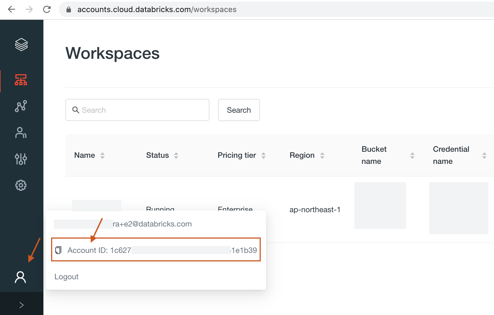
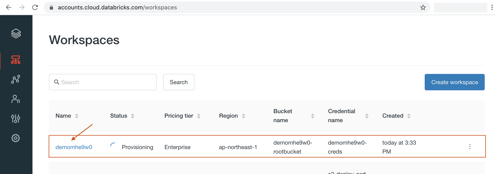

# TerraformによるDatabricks Workspaceの環境構築(AWS編)

Databricksのworkspaceは一つの独立したDatabricks環境を提供します。
そのため、要件によっては複数のworkspaceを同時に作成・運用するケースもあります。
こうした状況では、DatabricksのworkspaceをCodeとして管理(IaC)し、自動化することで運用がスムーズになります。

Databricksでは、運用現場で求められる機能をツールとして提供する[Labs Project](https://databricks.com/learn/labs)の一環で、[Databricsk Terraform Provider](https://github.com/databrickslabs/terraform-provider-databricks)を公開しています。
このドキュメントでは、Terraformを用いてAWS上にDatabricksのworkspaceを構築する方法を説明いたします。


## 必要な環境

* [AWS CLI](https://aws.amazon.com/jp/cli/)の実行環境
* AWS Credential(通常は`~/.aws/credentials`に作成される。上記のAWS CLIの実行のため)
* Databricks Onwer Account: Databricks Console([accounts.cloud.databricks.com](https://accounts.cloud.databricks.com/))にログインできるユーザー名/パスワード
* [Terraform](https://www.terraform.io/)実行環境


## 使用方法

### Terraformテンプレートのダウンロード

Tarraformのテンプレートをダウンロードします。
```bash
$ curl -O https://sajpstorage.blob.core.windows.net/demo-asset-workshop2021/snippet/db_terraform_example.zip

$ unzip db_terraform_example.zip
$ cd db_terraform_example
$ cd aws
$ ls

README.md		variable.tf
main.tf			secret.tfvars.template
```


### デプロイに関するパラメータの設定

`variable.tf`にデプロイする際の設定値を変数をとして定義してあります。


`variable.tf`
* `aws_connection_profile`: AWS CLIを使用する際のCredetialのprofile名
* `aws_region`: 構築するAWS Region
* `cidr_block` : 構築する際のVPCに使用するネットワークCIDR
* `read_write_s3_buckets` : Databricksと連携させるS3バケツのリスト(Read Write)
* `read_only_s3_buckets` : Databricksと連携させるS3バケツのリスト(Read Only)
* `user_prefix`: Workspaceのリソース名で使うプレフィックス文字列


ファイルを編集して、適宜設定していきます。


```bash
$ vim variable.tf  (もしくはお使いのテキストエディタで編集)

variable "aws_connection_profile" {
  description  = "The name of the AWS connection profile to use."
  type         = string
  default      = "default"
}

variable "aws_region" {
  description = "The code of the AWS Region to use."
  type        = string
  default     = "ap-northeast-1"
}
...
...
```

### クレデンシャルファイルの準備

続いて、`secret.tfavrs`のテンプレートから以下のDatabricksのアカウント情報を設定ファイルを作成していきます。
パスワードなどを含むファイルになりますので、取り扱いには注意してください。

* `databricks_account_username`: Databricks Consoleにログインする際のメールアドレス
* `databricks_account_password`: Databricks Consoleにログインする際のパスワード
* `databricks_account_id`: DatabircksアカウントのID (Databricks Consoleから確認できます)


DatabricksのアカウントIDは下記のようにconsole画面の左下メニューから確認できます。




```bash
$ cp secret.tfvars.template secret.tfvars
$ vim secret.tfvars  (もしくはお使いのテキストエディタで編集)

databricks_account_username = "your_accout_owner@example.com"
databricks_account_password = "xxxxxxxxxxxxxxxxxxx"
databricks_account_id       = "xxxxxxxx-xxxx-xxxxx-xxxxx-xxxxxxxxxxx"
```

### workspaceの作成

以上が設定が必要な項目になりますので、移行はTerraformを実行していきます。

Terraformの初期化(初回のみ)
```bash
$ terraform init
```

問題なければTerraformを実行して環境を構築します。
この実行によってAWS上にDatabricksのWorkspaceが構築されます。
```bash
$ terraform apply -var-file="secret.tfvars"

...
...
Apply complete! Resources: 36 added, 0 changed, 0 destroyed.

Outputs:

databricks_host = "https://xxxxxxxxx-demo08jmll.cloud.databricks.com"
databricks_instance_profile = "arn:aws:iam::134567891234:instance-profile/shared-instance-profile"
databricks_token = <sensitive>
```

ここで作成した各種リソースはDatabrciks ConsoleやAWS ConsoleのUI上からも確認可能です。




### workspaceの削除

環境を削除するには以下を実行する(実行には注意してください)
```bash
$ terraform destroy -var-file="secret.tfvars"

...
...
Destroy complete! Resources: 36 destroyed.
```


## 説明


### Resources

以下のResourceを構築します。
(手動でデプロイする場合の順に並べてあります)

 1. Cross Account IAM Role
 2. S3 Root Bucket
 3. Custom VPC
 4. Workspace
 5. Bucket for Data writing
 6. Instance Profile for S3 Access from Clusters


## Reference

* Tarraform 
  - [Provision Databricks workspaces with Terraform (E2)](https://docs.databricks.com/dev-tools/terraform/e2-workspace.html)
  - [Databricks - Terraform Provider (docs in databricks.com)](https://docs.databricks.com/dev-tools/terraform/index.html)
  - [Databricks - Terraform Provider (docs in registry.terraform.io)](https://registry.terraform.io/providers/databrickslabs/databricks/latest/docs)

